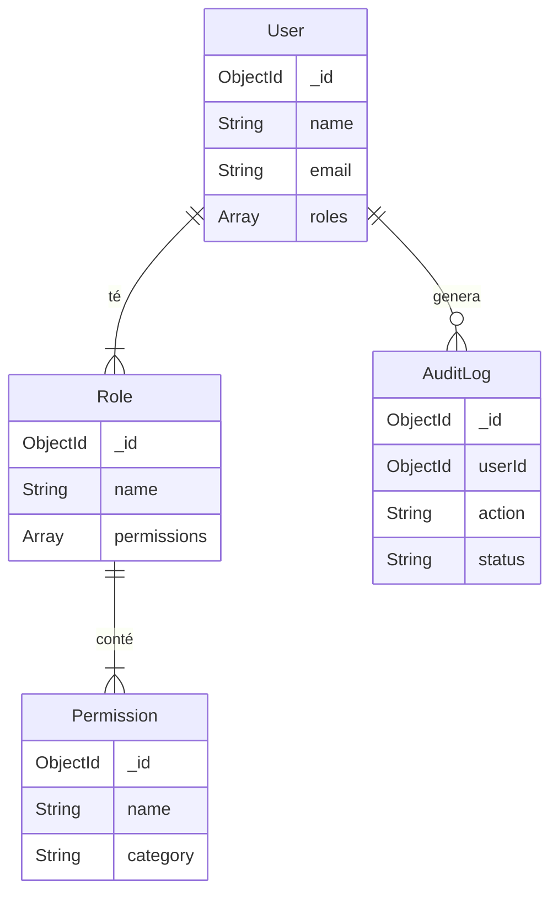

# Task Manager API - Advanced RBAC & Audit System

Aquesta API és una extensió del Task Manager que implementa un sistema avançat de **Control d'Accés Basat en Rols (RBAC)** amb permisos granulars i un registre complet d'**Auditoria**.

## 🚀 Instal·lació i Setup

### 1. Requisits Prèvis
- Node.js instal·lat
- MongoDB funcionant (localment o Atlas)

### 2. Instal·lació
```bash
# Instal·lar dependències
npm install

# Configurar variables d'entorn
# Crear un fitxer .env a l'arrel amb:
PORT=3000
MONGODB_URI=mongodb://127.0.0.1:27017/task_manager
JWT_SECRET=la_teva_clau_secreta_super_segura
```

### 3. Execució
```bash
# Mode desenvolupament (amb nodemon)
npm run dev

# Mode producció
npm start
```

AL iniciar el servidor per primera vegada, s'executaran automàticament els **seeds** que crearan els rols i permisos del sistema.

---

## 🔐 Sistema de Permisos (RBAC)

El sistema utilitza una arquitectura granular on els **Usuaris** tenen **Rols**, i els **Rols** tenen **Permisos**.

### Estructura de Models



### Rols del Sistema

1.  **Admin**: Accés total (`isSystemRole: true`).
2.  **User**: Accés bàsic a les seves pròpies tasques (`isSystemRole: true`).
3.  **Viewer**: Només pot llegir tasques (`isSystemRole: false`).
4.  **Editor**: Pot crear, llegir, editar i esborrar tasques (`isSystemRole: false`).

---

## 📋 Exemples d'Ús

### Autenticació
*   **Registre**: Assigna automàticament el rol `user`.
*   **Login**: Retorna el token JWT i la llista de permisos efectius de l'usuari.

### Gestió de Rols (Admin)
```http
POST /api/admin/roles
Authorization: Bearer <token_admin>
Content-Type: application/json

{
  "name": "moderator",
  "permissions": ["<ID_PERMIS_1>", "<ID_PERMIS_2>"]
}
```

### Verificació de Permisos
Pots verificar si tens permís per fer una acció específica:
```http
POST /api/auth/check-permission
{
  "permission": "tasks:create"
}
```

---

## 🛡️ Errors i Seguretat

### Casos d'Error Comuns

| Codi | Error | Descripció |
|------|-------|------------|
| 401 | `No autoritzat` | Manca el token o és invàlid. |
| 403 | `No tens permís...` | L'usuari no té el permís `tasks:create` (o el que pertoqui). |
| 404 | `Recurs no trobat` | ID invàlid o recurs inexistent. |
| 400 | `Error de validació` | Dades incorrectes al body (ex: email ja existeix). |

### Auditoria
Totes les accions de modificació (POST, PUT, DELETE) i els intents d'accés denegats (403) es registren automàticament a la col·lecció `AuditLog`.

Pots consultar els logs com a admin a:
`GET /api/admin/audit-logs`
